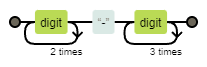
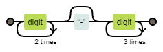
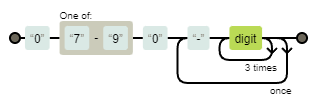
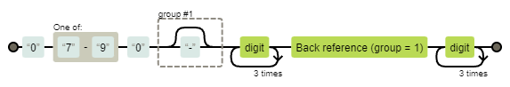
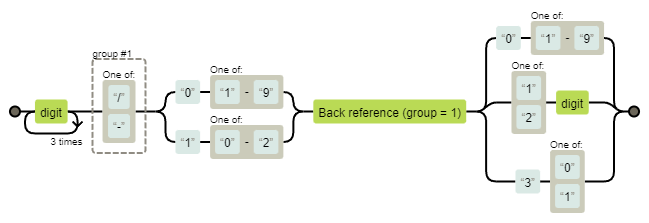
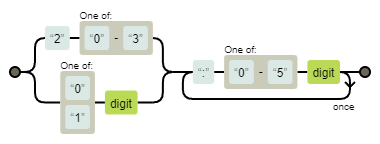

## 参考サイト・ツール

- [正規表現構文早見表 - JavaScript | MDN](https://developer.mozilla.org/ja/docs/Web/JavaScript/Guide/Regular_expressions/Cheatsheet)
- [Regex Learn - Playground](https://regexlearn.com/playground)（プレイグラウンド）
- [Regexper](https://regexper.com/)（可視化）
- [Regex Vis](https://regex-vis.com/)（可視化＆テスト）

## チートシート

### Anchors

| 文字 |      意味      |
| :--- | :------------- |
| `^`  | 行の先頭       |
| `$`  | 行の末尾       |
| `\b` | 単語の境界     |
| `\B` | 単語以外の境界 |

### Character Classes

|   文字   |                  意味                   |
| :------- | :-------------------------------------- |
| `\d`     | 数字                                    |
| `\D`     | 数字以外                                |
| `\w`     | 単語構成文字                            |
| `\W`     | 非単語構成文字                          |
| `\s`     | 空白文字                                |
| `\S`     | 非空白文字                              |
| `\xhh`   | `hh`（2桁の16進数）コードからなる文字   |
| `\uhhhh` | `hhhh`（4桁の16進数）コードからなる文字 |

### Special Characters

|  文字  |                          意味                          |
| :----- | :----------------------------------------------------- |
| `\`    | 次の文字を特別に扱うこと、「エスケープ」することを示す |
| `\n`   | 改行文字                                               |
| `\r`   | キャリッジリターン文字                                 |
| `\t`   | 水平タブ                                               |
| `\v`   | 垂直タブ                                               |
| `[\b]` | バックスペース                                         |

### Ranges/Groups

| 文字    |           意味            |
| :------ | :------------------------ |
| `.`     | 改行文字を除く任意の1文字 |
| `x\|y`  | `x`または`y`              |
| `(x)`   | キャプチャグループ        |
| `(x:?)` | 非キャプチャグループ      |
| `[xyz]` | 囲んだ文字のいずれかに一致（`x` or `y` or `z`） |
| `[^xyz]` | 囲んだ文字のいずれにも一致しない（Not `x` or `y` or `z`） |
| `[a-c]` | 囲んだ文字の範囲内の文字に一致（アルファベット小文字`a`～`c`） e.g. 　`[A-Q]`: アルファベット大文字`A`～`Q` 　`[0-4]`: 数字`1`～`4` |
| `[^a-c]` | 囲んだ文字の範囲外の文字に一致（アルファベット小文字`a`～`c`以外） |
| `\n` | `n`番目の括弧の部分に一致した最新の部分文字列への後方参照（`n`: 正の整数） |

### Assertions

|   文字    |                                 意味                                  |
| :-------- | :-------------------------------------------------------------------- |
| `x(?=y)`  | 先読みアサーション `x`の後に`y`が続く場合のみ`x`に一致             |
| `x(?!y)`  | 否定先読みアサーション `x`の後に`y`が続いていない場合のみ`x`に一致 |
| `(?<=y)x` | 後読みアサーション `x`の前に`y`がある場合のみ`x`に一致             |
| `(?<!y)x` | 否定後読みアサーション `x`の前に`y`がない場合のみ`x`に一致         |

### Quantifiers

|   文字   |                                      意味                                       |
| :------- | :------------------------------------------------------------------------------ |
| `*`      | 0回以上の繰り返し                                                               |
| `*?`     | 0回以上の繰り返し（ℹ️非貪欲）                                                   |
| `+`      | 1回以上の繰り返し                                                               |
| `+?`     | 1回以上の繰り返し（ℹ️非貪欲）                                                   |
| `?`      | 0回か1回の出現                                                                  |
| `??`     | 0回か1回の出現（ℹ️非貪欲）                                                      |
| `{n}`    | `n`回の繰り返し（`n`:正の整数）                                                 |
| `{n}?`   | `n`回の繰り返し（`n`:正の整数）（ℹ️非貪欲）                                     |
| `{n,}`   | `n`回以上の繰り返し（`n`:正の整数）                                             |
| `{n,}?`  | `n`回以上の繰り返し（`n`:正の整数）（ℹ️非貪欲）                                 |
| `{n,m}`  | `n`回以上`m`回以下の繰り返し（`n >= 0`かつ`n < m`かつ`m`:正の整数）             |
| `{n,m}?` | `n`回以上`m`回以下の繰り返し（`n >= 0`かつ`n < m`かつ`m`:正の整数）（ℹ️非貪欲） |

::: info ℹ️非貪欲
既定では`*`や`+`といった数量詞は「貪欲」、つまり、できる限り多くの文字列に一致しようとする。 
数量詞の後に`?`の文字を指定すると、数量詞が「非貪欲」、つまり、一致が見つかるとすぐに停止する。

- `some <foo> <bar> new </bar> </foo> thing`
  - `/<.*>/`  → `<foo> <bar> new </bar> </foo>`に一致
  - `/<.*?>/` → `<foo>`に一致
:::

## サンプル

### 汎用

| 説明 | 正規表現 | ダイアグラム |
| :--- | :------- | :----------- |
| 郵便番号 | `\d{3}-\d{4}` |  |
| 郵便番号（`-`の省略を許容） | `\d{3}-?\d{4}` |  |
| 携帯電話番号 | `0[7-9]0(?:-\d{4}){2}` |  |
| 携帯電話番号（`-`の省略を許容） | `0[7-9]0(-?)\d{4}\1\d{4}` |  |
| メールアドレス | `[a-zA-Z0-9_.+-]+@([a-zA-Z0-9][a-zA-Z0-9-]*[a-zA-Z0-9]*\.)+[a-zA-Z]{2,}` | https://regexper.com/#%5Ba-zA-Z0-9_.%2B-%5D%2B%40%28%5Ba-zA-Z0-9%5D%5Ba-zA-Z0-9-%5D*%5Ba-zA-Z0-9%5D*%5C.%29%2B%5Ba-zA-Z%5D%7B2%2C%7D |

### 日時

| 説明 | 正規表現 | ダイアグラム |
| :--- | :------- | :----------- |
| `yyyy/mm/dd`もしくは`yyyy-mm-dd`形式の日付 | `\d{4}([\/-])(?:0[1-9]\|1[0-2])\1(?:0[1-9]\|[12]\d\|3[01])` |  |
| 時間 | `(?:2[0-3]\|[01]\d)(?::(?:[0-5]\d)){2}` |  |

### IT

| 説明 | 正規表現 | ダイアグラム |
| :--- | :------- | :----------- |
| IPアドレス | `((25[0-5]\|2[0-4]\d\|1\d{2}\|[1-9]?\d)\.){3}(25[0-5]\|2[0-4]\d\|1\d{2}\|[1-9]?\d)` | https://regexper.com/#%28%2825%5B0-5%5D%7C2%5B0-4%5D%5Cd%7C1%5Cd%7B2%7D%7C%5B1-9%5D%3F%5Cd%29%5C.%29%7B3%7D%2825%5B0-5%5D%7C2%5B0-4%5D%5Cd%7C1%5Cd%7B2%7D%7C%5B1-9%5D%3F%5Cd%29 |
| URL | `https?:\/\/(www\.)?[-a-zA-Z0-9@:%._\+~#=]{1,256}\.[a-zA-Z0-9()]{1,6}\b([-a-zA-Z0-9()@:%_\+.~#?&//=]*)` | https://regexper.com/#https%3F%3A%5C%2F%5C%2F%28www%5C.%29%3F%5B-a-zA-Z0-9%40%3A%25._%5C%2B~%23%3D%5D%7B1%2C256%7D%5C.%5Ba-zA-Z0-9%28%29%5D%7B1%2C6%7D%5Cb%28%5B-a-zA-Z0-9%28%29%40%3A%25_%5C%2B.~%23%3F%26%2F%2F%3D%5D*%29 |
