## 公式HP

<LinkCard
  url="https://mermaid.js.org/intro/#diagram-types"
  label="About Mermaid"
  imageUrl="https://mermaid.js.org/favicon.ico"
  description="Create diagrams and visualizations using text and code."
/>

## 一覧

|                      図                       |      キーワード      | 公式ページ |
| :-------------------------------------------- | :------------------- | :--------- |
| [フローチャート](#フローチャート)             | `flowchart`          | https://mermaid.js.org/syntax/flowchart.html |
| [シーケンス図](#シーケンス図)                 | `sequenceDiagram`    | https://mermaid.js.org/syntax/sequenceDiagram.html |
| [クラス図](#クラス図)                         | `classDiagram`       | https://mermaid.js.org/syntax/classDiagram.html |
| [状態遷移図](#状態遷移図)                     | `stateDiagram-v2`    | https://mermaid.js.org/syntax/stateDiagram.html |
| [ER図](#er図)                                 | `erDiagram`          | https://mermaid.js.org/syntax/entityRelationshipDiagram.html |
| [ジャーニーマップ](#ジャーニーマップ)         | `journey`            | https://mermaid.js.org/syntax/userJourney.html |
| [ガントチャート](#ガントチャート)             | `gantt`              | https://mermaid.js.org/syntax/gantt.html |
| [円グラフ](#円グラフ)                         | `pie`                | https://mermaid.js.org/syntax/pie.html |
| [クアドラントチャート](#クアドラントチャート) | `quadrantChart`      | https://mermaid.js.org/syntax/quadrantChart.html |
| [要件図](#要件図)                             | `requirementDiagram` | https://mermaid.js.org/syntax/requirementDiagram.html |
| [Gitグラフ](#gitグラフ)                       | `gitGraph`           | https://mermaid.js.org/syntax/gitgraph.html |
| [C4図](#c4図)                                 | `C4Context`          | https://mermaid.js.org/syntax/c4.html |
| [マインドマップ](#マインドマップ)             | `mindmap`            | https://mermaid.js.org/syntax/mindmap.html |
| [タイムライン](#タイムライン)                 | `timeline`           | https://mermaid.js.org/syntax/timeline.html |
| [サンキーダイアグラム](#サンキーダイアグラム) | `sankey`             | https://mermaid.js.org/syntax/sankey.html |
| [XYチャート](#xyチャート)                     | `xychart-beta`       | https://mermaid.js.org/syntax/xyChart.html |

## フローチャート

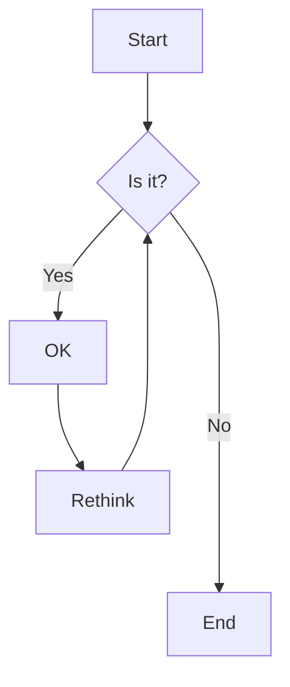

```
flowchart LR
  A[Start] --> B{Is it?}
  B -->|Yes| C[OK]
  C --> D[Rethink]
  D --> B
  B ---->|No| E[End]
```

## シーケンス図

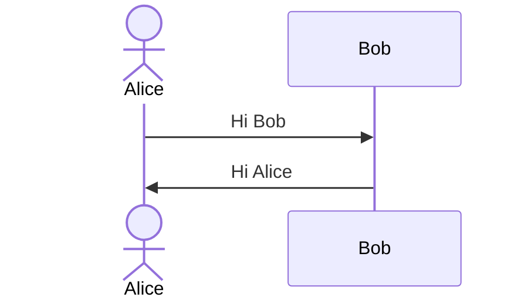

```
sequenceDiagram
  actor  Alice
  participant Bob
  Alice->>Bob: Hi Bob
  Bob->>Alice: Hi Alice
```

## クラス図

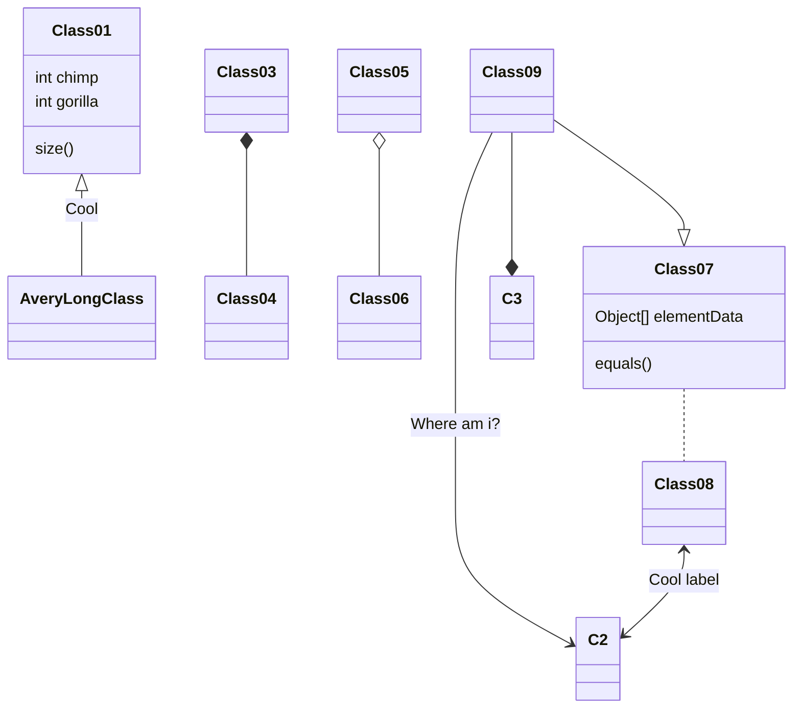

```
classDiagram
  Class01 <|-- AveryLongClass : Cool
  Class03 *-- Class04
  Class05 o-- Class06
  Class07 .. Class08
  Class09 --> C2 : Where am i?
  Class09 --* C3
  Class09 --|> Class07
  Class07 : equals()
  Class07 : Object[] elementData
  Class01 : size()
  Class01 : int chimp
  Class01 : int gorilla
  Class08 <--> C2: Cool label
```

## 状態遷移図

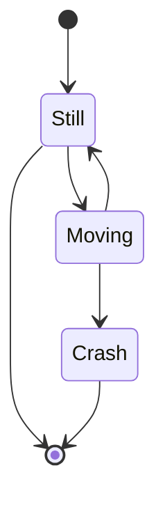

```
stateDiagram
  [*] --> Still
  Still --> [*]

  Still --> Moving
  Moving --> Still
  Moving --> Crash
  Crash --> [*]
```

## ER図

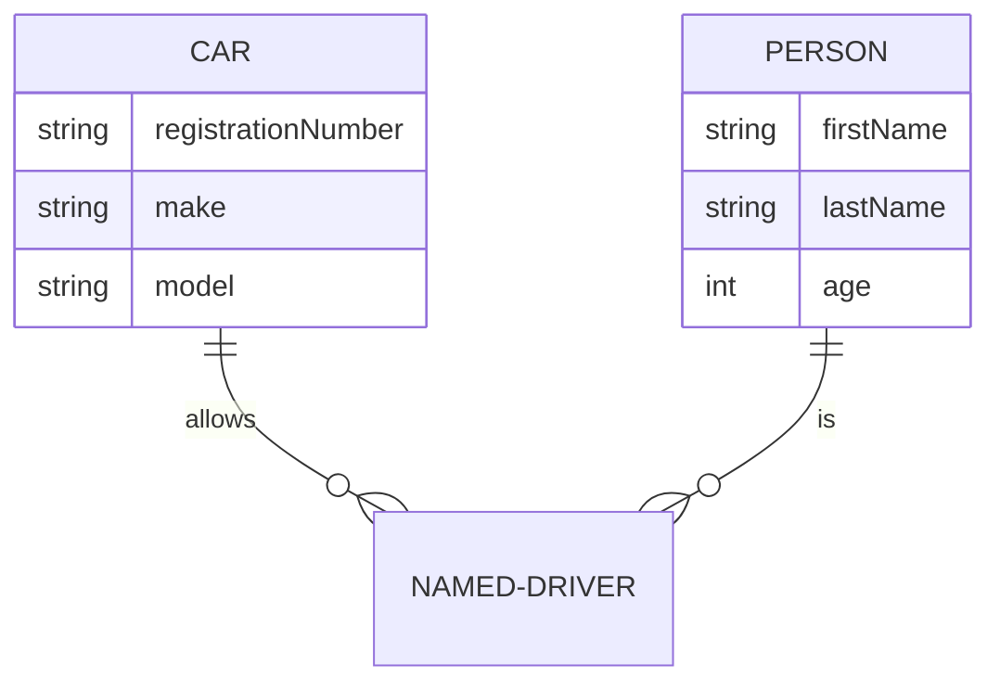

```
erDiagram
  CAR ||--o{ NAMED-DRIVER : allows
  CAR {
    string registrationNumber
    string make
    string model
  }
  PERSON ||--o{ NAMED-DRIVER : is
  PERSON {
    string firstName
    string lastName
    int age
  }
```

## ジャーニーマップ

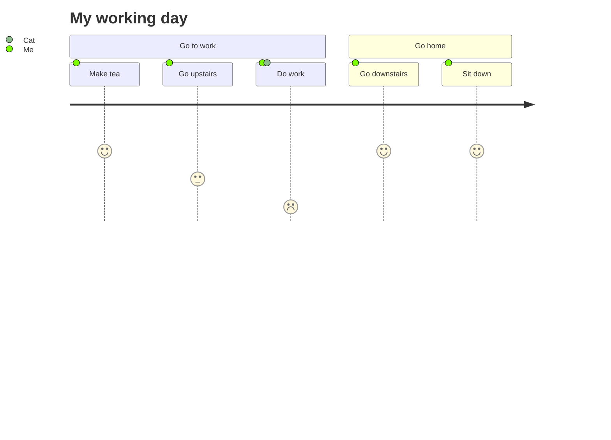

```
journey
  title My working day
  section Go to work
    Make tea: 5: Me
    Go upstairs: 3: Me
    Do work: 1: Me, Cat
  section Go home
    Go downstairs: 5: Me
    Sit down: 5: Me
```

## ガントチャート

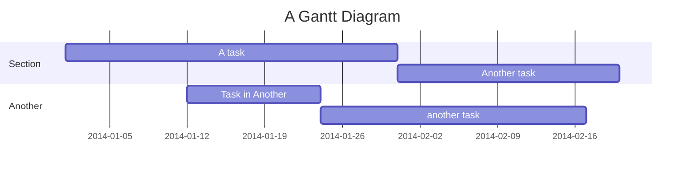

```
gantt
  title A Gantt Diagram
  dateFormat YYYY-MM-DD
  section Section
    A task          :a1, 2014-01-01, 30d
    Another task    :after a1, 20d
  section Another
    Task in Another :2014-01-12, 12d
    another task    :24d
```

## 円グラフ

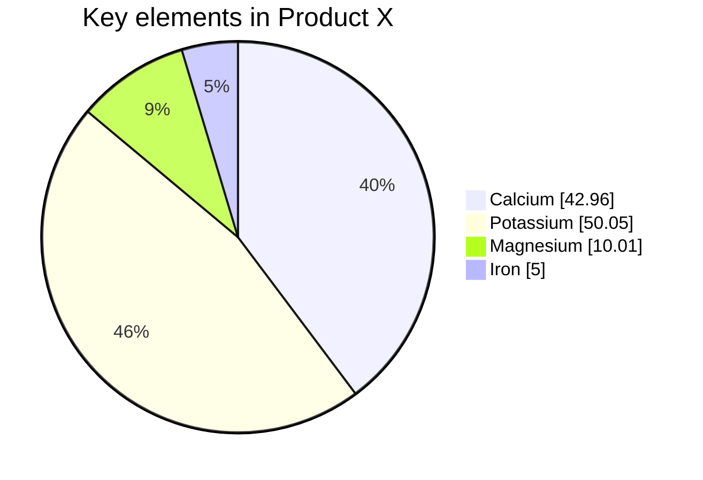

```
pie showData
  title Key elements in Product X
  "Calcium" : 42.96
  "Potassium" : 50.05
  "Magnesium" : 10.01
  "Iron" :  5
```

## クアドラントチャート

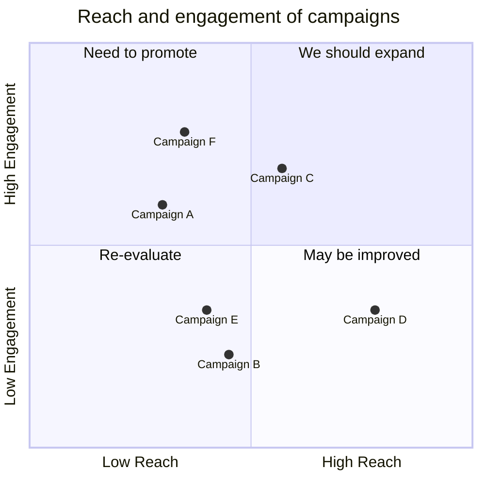

```
quadrantChart
  title Reach and engagement of campaigns
  x-axis Low Reach --> High Reach
  y-axis Low Engagement --> High Engagement
  quadrant-1 We should expand
  quadrant-2 Need to promote
  quadrant-3 Re-evaluate
  quadrant-4 May be improved
  Campaign A: [0.3, 0.6]
  Campaign B: [0.45, 0.23]
  Campaign C: [0.57, 0.69]
  Campaign D: [0.78, 0.34]
  Campaign E: [0.40, 0.34]
  Campaign F: [0.35, 0.78]
```

## 要件図

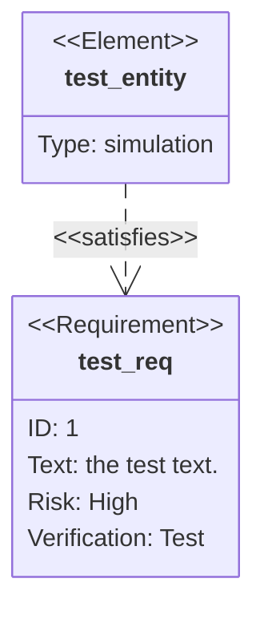

```
  requirementDiagram

  requirement test_req {
    id: 1
    text: the test text.
    risk: high
    verifymethod: test
  }

  element test_entity {
    type: simulation
  }

  test_entity - satisfies -> test_req
```

## Gitグラフ

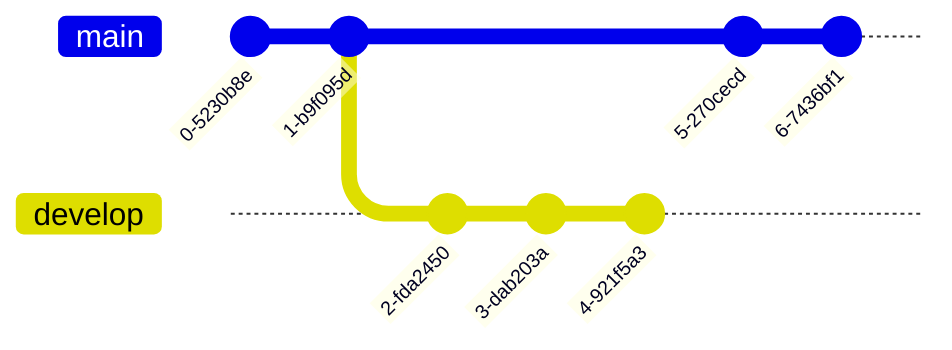

```
gitGraph
  commit
  commit
  branch develop
  commit
  commit
  commit
  checkout main
  commit
  commit
```

## C4図

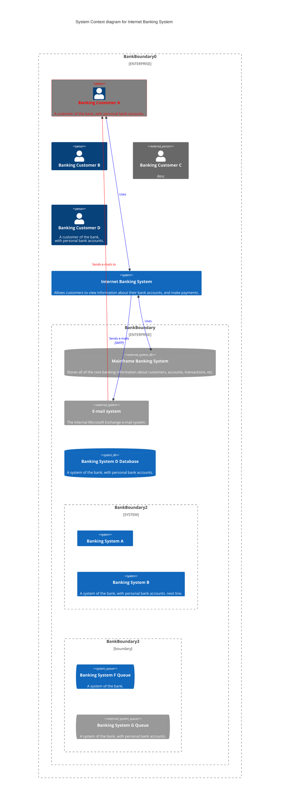

```
C4Context
  title System Context diagram for Internet Banking System
  Enterprise_Boundary(b0, "BankBoundary0") {
    Person(customerA, "Banking Customer A", "A customer of the bank, with personal bank accounts.")
    Person(customerB, "Banking Customer B")
    Person_Ext(customerC, "Banking Customer C", "desc")

    Person(customerD, "Banking Customer D", "A customer of the bank, <br/> with personal bank accounts.")

    System(SystemAA, "Internet Banking System", "Allows customers to view information about their bank accounts, and make payments.")

    Enterprise_Boundary(b1, "BankBoundary") {

      SystemDb_Ext(SystemE, "Mainframe Banking System", "Stores all of the core banking information about customers, accounts, transactions, etc.")

      System_Boundary(b2, "BankBoundary2") {
        System(SystemA, "Banking System A")
        System(SystemB, "Banking System B", "A system of the bank, with personal bank accounts. next line.")
      }

      System_Ext(SystemC, "E-mail system", "The internal Microsoft Exchange e-mail system.")
      SystemDb(SystemD, "Banking System D Database", "A system of the bank, with personal bank accounts.")

      Boundary(b3, "BankBoundary3", "boundary") {
        SystemQueue(SystemF, "Banking System F Queue", "A system of the bank.")
        SystemQueue_Ext(SystemG, "Banking System G Queue", "A system of the bank, with personal bank accounts.")
      }
    }
  }

  BiRel(customerA, SystemAA, "Uses")
  BiRel(SystemAA, SystemE, "Uses")
  Rel(SystemAA, SystemC, "Sends e-mails", "SMTP")
  Rel(SystemC, customerA, "Sends e-mails to")

  UpdateElementStyle(customerA, $fontColor="red", $bgColor="grey", $borderColor="red")
  UpdateRelStyle(customerA, SystemAA, $textColor="blue", $lineColor="blue", $offsetX="5")
  UpdateRelStyle(SystemAA, SystemE, $textColor="blue", $lineColor="blue", $offsetY="-10")
  UpdateRelStyle(SystemAA, SystemC, $textColor="blue", $lineColor="blue", $offsetY="-40", $offsetX="-50")
  UpdateRelStyle(SystemC, customerA, $textColor="red", $lineColor="red", $offsetX="-50", $offsetY="20")

  UpdateLayoutConfig($c4ShapeInRow="3", $c4BoundaryInRow="1")
```

## マインドマップ

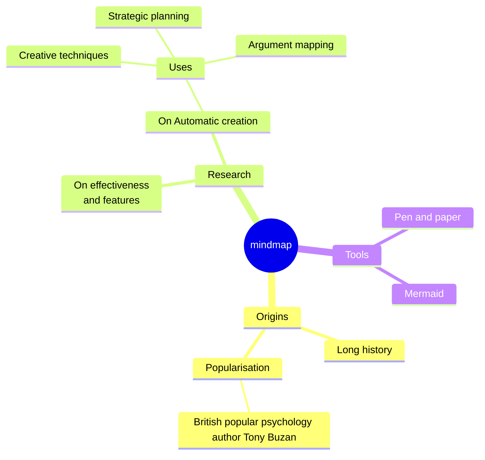

```
mindmap
  root((mindmap))
    Origins
      Long history
      ::icon(fa fa-book)
      Popularisation
        British popular psychology author Tony Buzan
    Research
      On effectiveness<br/>and features
      On Automatic creation
        Uses
            Creative techniques
            Strategic planning
            Argument mapping
    Tools
      Pen and paper
      Mermaid
```

## タイムライン

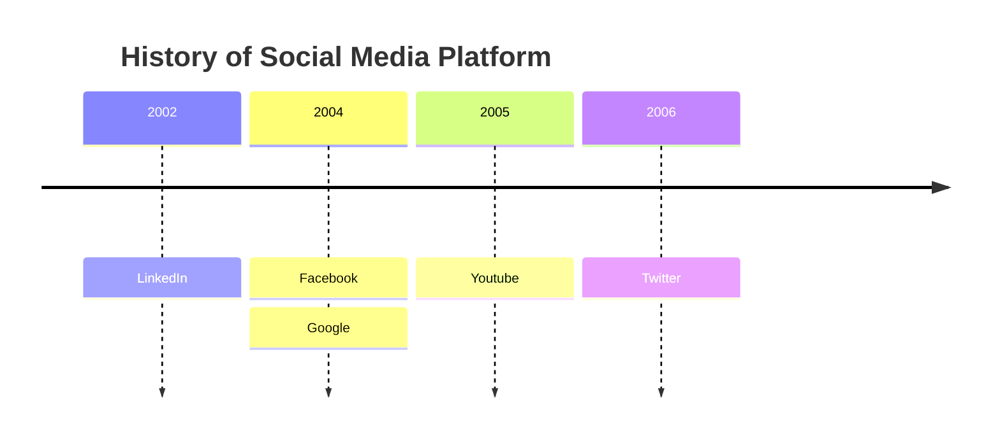

```
timeline
  title History of Social Media Platform
  2002 : LinkedIn
  2004 : Facebook
        : Google
  2005 : Youtube
  2006 : Twitter
```

## サンキーダイアグラム

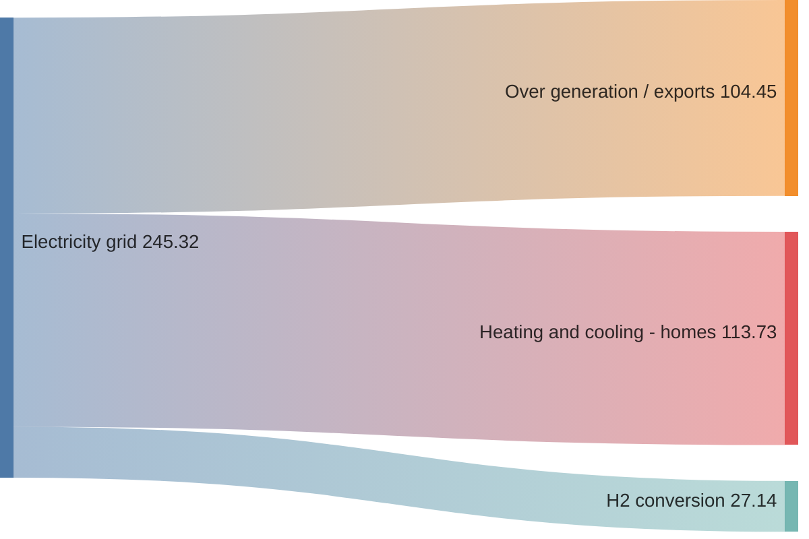

```
sankey-beta

%% source,target,value
Electricity grid,Over generation / exports,104.453
Electricity grid,Heating and cooling - homes,113.726
Electricity grid,H2 conversion,27.14
```

## XYチャート

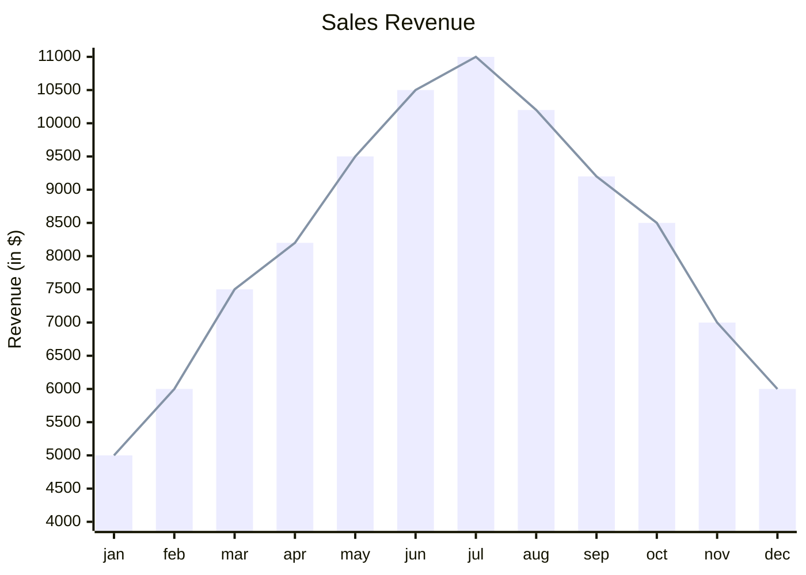

```
xychart-beta
  title "Sales Revenue"
  x-axis [jan, feb, mar, apr, may, jun, jul, aug, sep, oct, nov, dec]
  y-axis "Revenue (in $)" 4000 --> 11000
  bar [5000, 6000, 7500, 8200, 9500, 10500, 11000, 10200, 9200, 8500, 7000, 6000]
  line [5000, 6000, 7500, 8200, 9500, 10500, 11000, 10200, 9200, 8500, 7000, 6000]
```
